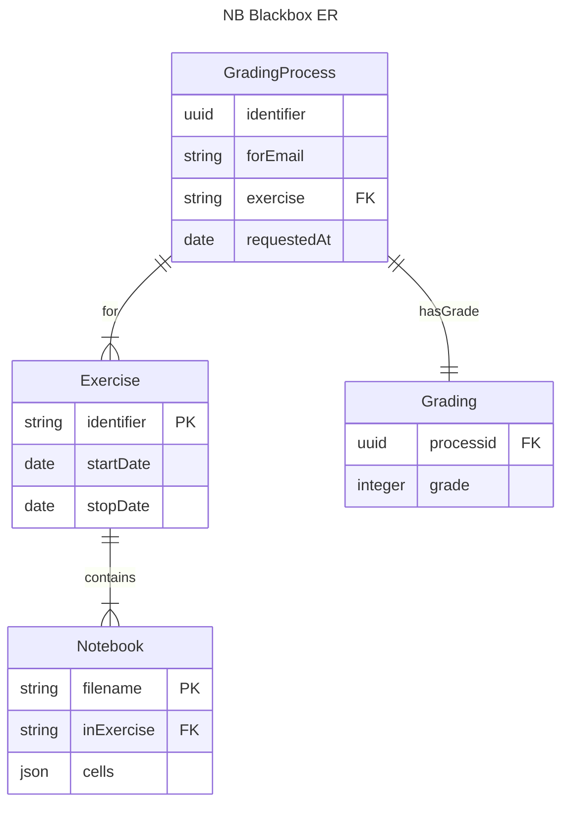

# NB Blackbox data model

```mermaid
---
title: NB Blackbox ER
---

erDiagram
    Exercise {
        string identifier PK
        date startDate
        date stopDate
    }
    Notebook {
        string filename PK
        string inExercise FK
        json cells
    }
    
    GradingProcess {
        uuid identifier
        string forEmail
        string exercise FK
        date requestedAt
    }
    
    Grading {
        uuid processid FK
        integer grade
    }
    
    Exercise ||--|{ Notebook: contains
    GradingProcess ||--|{ Exercise: for
    GradingProcess ||--|| Grading: hasGrade
```
