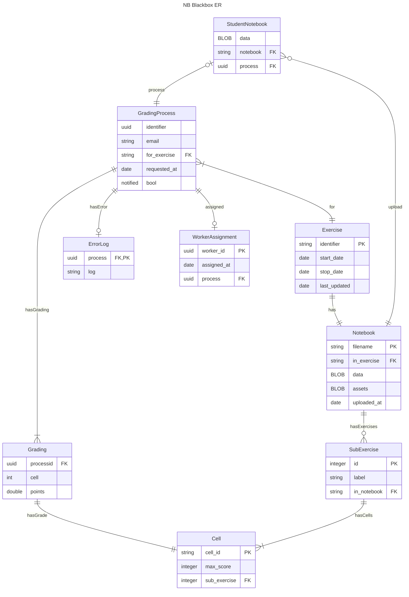

# NB Blackbox data model
**This is for overview only, when in doubt always refer to the schema defined in grader/model.py**

```mermaid
---
title: NB Blackbox ER
---

erDiagram
    Exercise {
        string identifier PK
        date start_date
        date stop_date
        date last_updated
    }

    Notebook {
        string filename PK
        string in_exercise FK
        BLOB data
        BLOB assets
        date uploaded_at
    }
    
    SubExercise {
        integer id PK
        string label
        string in_notebook FK
    }
    
    Cell {
        string cell_id PK
        integer max_score
        integer sub_exercise FK
    }
    
    GradingProcess {
        uuid identifier
        string email
        string for_exercise FK
        date requested_at
        notified bool
    }
    
    Grading {
        uuid processid FK
        int cell
        double points
    }
    
    ErrorLog {
        uuid process FK,PK
        string log
    }
    
    WorkerAssignment {
        uuid worker_id PK
        date assigned_at
        uuid process FK
    }
    
    StudentNotebook {
        BLOB data
        string notebook FK
        uuid process FK
    }
        
    Exercise ||--|| Notebook: has
    GradingProcess }|--|| Exercise: for
    GradingProcess ||--|{ Grading: hasGrading
    GradingProcess ||--o| ErrorLog: hasError
    
    Grading ||--|| Cell: hasGrade

    Notebook ||--o{ SubExercise: hasExercises
    SubExercise ||--|{ Cell: hasCells

    GradingProcess ||--o| WorkerAssignment: assigned
    StudentNotebook }o--|| Notebook: upload
    StudentNotebook |o--|| GradingProcess: process
```
